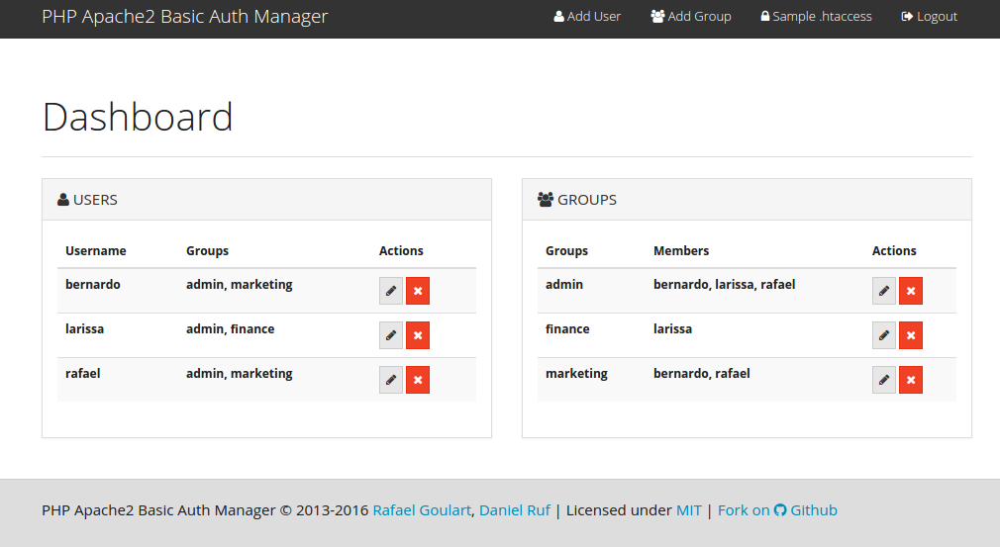

# PHP Apache2 Basic Auth Manager

A really simple manager for .htaccess Basic Auth using .htpasswd and .htgroups
files.

Uses the
[PHP Apache2 Basic Auth](https://github.com/rafaelgou/php-apache2-basic-auth)
lib.




## Install

1) Clone the repository under a web:

Considering you have a Apache Web Server running with ServerRoot= `/var/www`.

```bash
cd /var/www
git clone https://github.com/rafaelgou/php-apache2-basic-auth-manager.git
```

2) Configure the application

```bash
cd php-apache2-basic-auth-manager
cp config.yml.dist config.yml
chown -R www-data:www-data *
```

(or whatever user your webserver is running under).

Edit `config.yml` using your favorite editor, and be sure to point to the
right paths for `.htpasswd`  and `.htgroups` files.

```yml
# Base URL
baseUrl: http://localhost/php-apache2-basic-auth-manager

# Path to Apache2 files
htpasswd: '/home/rafael/Dev/Rgou/.htpasswd'
htgroups: '/home/rafael/Dev/Rgou/.htgroups'

# Debug
debug: false
```

3) Apache config

The system directory must have:

```apache2
AllowOverride All
```

to permit Basic Auth.

4) Create `.htpasswd` and `.htgroups` files

They can be anywhere, but must be readable by webserver user (e.g. www-data).
You need to create a initial admin user:

```bash
htpasswd -cB /var/www/.htpasswd superuser
chown www-data:www-data /var/www/.htpasswd
```


```bash
echo 'admin: superuser' > /var/www/.htgroups
chown www-data:www-data /var/www/.htgroups
```

5) Create .htaccess file for the system

```bash
cd php-apache2-basic-auth-manager
```

Edit `.htaccess` using your favorite editor, and put the following content

```apache
AuthName "Members Area"
AuthType Basic
AuthUserFile /var/www/.htpasswd
AuthGroupFile /var/www/.htgroups
<Limit GET POST>
    require group admin
    # or
    # require user superuser
</Limit>
```

6) Now you can access

http://localhost/php-apache2-basic-auth-manager

Use the user/password created above.
